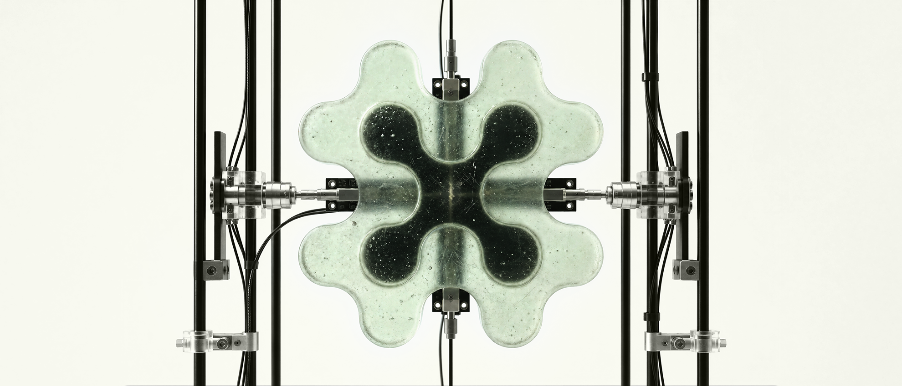

<p align="right">
  <a href="README.md"></a>
  <a href="README.en.md"></a>
</p>

<p align="center">
  
</p>

# Design Factory

HYVE's first open-source project.

<p>
  <a href="LICENSE"></a>
  <a href="package.json"></a>
  <a href="docs/providers.md"></a>
</p>

An open experiment offering a local workspace that makes context, direction,
and taste more operable inside AI-assisted design. An open-source alternative
to Claude Design and other closed AI-assisted design applications.

## What ships in this version

- configuration of formats, rules, commands, and prompts;
- generation of editable HTML artifacts;
- design-system ingestion and preview;
- skill creation and import;
- tweaks via CSS variables;
- inline text editing and component property edits;
- comments as structured direction;
- version snapshots, file manager, and embedded terminal;
- public documentation.

## Providers you can use inside the same project

- Claude Code
- Codex
- Gemini
- Opencode
- Kimi
- OpenRouter
- Ollama

---

## Get started

First, install these two free programs (skip any you already have):

- **Node.js** (version 20 or newer) — the engine that runs the app. Download it
  from [nodejs.org](https://nodejs.org/) and click the big **LTS** button. Open
  the downloaded file and click through to install.
- **Git** — used to download and update the project. Get it from
  [git-scm.com/downloads](https://git-scm.com/downloads).

You also need at least one AI CLI (such as Claude Code) or an API key — that's
what generates the designs.

With both installed, open a terminal and run:

```bash
git clone https://github.com/the-hyve-company/design-factory.git
cd design-factory
npm install
npm run dev:web
```

The launcher boots the app and opens your browser at `http://localhost:1420`. If
the port is busy, it picks another and prints the URL.

No terminal: after cloning, double-click `start.command` (macOS) or `start.bat`
(Windows). The first run installs dependencies and opens the app. To update,
use `update.command` / `update.bat`.

> **macOS first-time gotcha:** if you see "cannot be opened because Apple cannot
> verify it", that's just because the app is open-source and unsigned. **Right-
> click** (or Control-click) `start.command` → **Open** → **Open** again on the
> warning. After that, double-click works as usual. (Cloning with `git` avoids
> this; the `.zip` download is what triggers macOS quarantine.)

### Day to day (once installed)

Open the terminal **inside the project folder**: in Terminal, type `cd ` (with
a space), drag the `design-factory` folder from Finder into the window, and
press Enter. With the terminal in the folder, just copy:

**Open Design Factory:**

```bash
npm run dev:web
```

**Update to the latest version:**

```bash
git fetch origin && git reset --hard origin/main && npm install
```

After opening, go to Settings → Providers. CLIs you're already logged into show
as connected; BYOK keys are optional. Create a project, add context, generate,
and refine with tweaks, comments, and edits. Step-by-step in
[docs/quickstart.md](docs/quickstart.md).

---

## Status

Design Factory is early. The local path above is the tested, recommended one.

| Area | State |
| --- | --- |
| HTML generation, projects, versions | stable |
| Multi-provider picker (CLI / BYOK / local) | stable |
| Design systems, tweaks, comments, inline edit | stable |
| Embedded terminal | experimental |

---

## Providers

| Class | Examples | Notes |
| --- | --- | --- |
| CLI agents | Claude Code, Codex, Gemini, Opencode, Kimi | the local daemon spawns them |
| BYOK APIs | Anthropic, OpenAI, Gemini, OpenRouter | keys stay local |
| Local server | Ollama | offline |

Tokens live in `~/.config/design-factory/` or your environment. The browser
never touches provider secrets; the daemon runs them. Canonical source:
[docs/providers.md](docs/providers.md).

---

## Architecture

A React app (UI, flow, preview, settings) plus a Node daemon (filesystem,
provider execution, SSE streams, terminal). Stack: React 18, Vite, TypeScript,
Zod, Node 20 HTTP/SSE, Vitest.

```txt
src/          React app
apps/daemon/  Local Node bridge
docs/         Documentation
skills/       Reusable instruction blocks
projects/     Local work (gitignored)
```

---

## Commands

```bash
npm run dev:web     # app + daemon (opens the browser)
npm run build       # TypeScript + Vite
npm test            # Vitest
```

Before a PR: `npx tsc --noEmit && npm test && npm run build`.

---

## Contributing

The method has to stay inspectable and forkable. Start with
[CONTRIBUTING.md](CONTRIBUTING.md) and [docs/providers.md](docs/providers.md).
Open areas: provider adapters, design-system ingestion, artifact editing, visual
quality gates, docs, and tests.

---

## License

[Apache License 2.0](LICENSE) © The HYVE Company. Use, fork, study, and adapt.
Read [NOTICE](NOTICE) before reusing the HYVE or Design Factory marks: the
license covers code and docs, the mark stays reserved.
